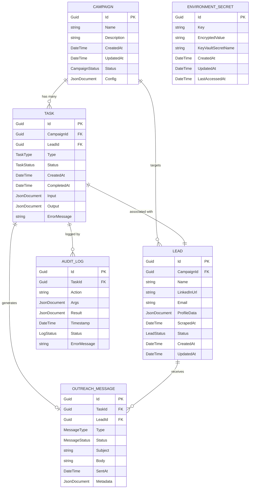

# Data Model: LinkedIn Outreach Copilot Agent
**Feature**: LinkedIn Outreach Copilot Agent  
**Date**: 2026-01-07  
**Version**: 1.0.0

## Entity Relationship Diagram (Mermaid)



---

## Entity Definitions

### 1. Campaign

**Purpose**: Represents a LinkedIn outreach campaign with configuration and target audience definition.

**Schema**:
```csharp
public class Campaign
{
    public Guid Id { get; set; }
    public string Name { get; set; } = string.Empty;
    public string? Description { get; set; }
    public DateTime CreatedAt { get; set; }
    public DateTime UpdatedAt { get; set; }
    public CampaignStatus Status { get; set; }
    public JsonDocument Config { get; set; } = JsonDocument.Parse("{}");

    // Navigation properties
    public ICollection<Task> Tasks { get; set; } = new List<Task>();
    public ICollection<Lead> Leads { get; set; } = new List<Lead>();
}

public enum CampaignStatus
{
    Draft,
    Active,
    Paused,
    Completed,
    Archived
}
```

**Config JSON Structure**:
```json
{
  "searchKeywords": "CTO SaaS B2B",
  "targetCompanySize": "50-200 employees",
  "targetLocation": "United States",
  "messagingSequence": [
    {
      "dayOffset": 0,
      "template": "Hi {{firstName}}, I noticed..."
    },
    {
      "dayOffset": 3,
      "template": "Following up on..."
    }
  ],
  "dailyQuota": 50,
  "sessionDurationHours": 2
}
```

**Validation Rules**:
- `Name` required, max 200 characters
- `Config.dailyQuota` must be ≤ 50 (FR-039)
- `Config.sessionDurationHours` must be ≤ 2 (FR-039)
- `Status` transitions: Draft → Active, Active ↔ Paused, Active → Completed, * → Archived

**Indexes**:
- `IX_Campaign_Status` on `Status` (for active campaign queries)
- `IX_Campaign_CreatedAt` on `CreatedAt` (for sorting)

---

### 2. Task

**Purpose**: Represents a single atomic action in the campaign execution flow (e.g., scrape profile, send message).

**Schema**:
```csharp
public class Task
{
    public Guid Id { get; set; }
    public Guid CampaignId { get; set; }
    public Guid LeadId { get; set; }
    public TaskType Type { get; set; }
    public TaskStatus Status { get; set; }
    public DateTime CreatedAt { get; set; }
    public DateTime? CompletedAt { get; set; }
    public JsonDocument Input { get; set; } = JsonDocument.Parse("{}");
    public JsonDocument? Output { get; set; }
    public string? ErrorMessage { get; set; }

    // Navigation properties
    public Campaign Campaign { get; set; } = null!;
    public Lead Lead { get; set; } = null!;
    public OutreachMessage? OutreachMessage { get; set; }
    public ICollection<AuditLog> AuditLogs { get; set; } = new List<AuditLog>();
}

public enum TaskType
{
    ScrapeProfile,
    SendLinkedInMessage,
    SendEmail,
    WaitCooldown
}

public enum TaskStatus
{
    Pending,
    InProgress,
    Completed,
    Failed,
    Cancelled
}
```

**Input/Output JSON Examples**:
```json
// ScrapeProfile Input
{
  "linkedInUrl": "https://www.linkedin.com/in/johndoe/",
  "targetFields": ["name", "title", "company", "email"]
}

// ScrapeProfile Output
{
  "name": "John Doe",
  "title": "CTO",
  "company": "Example Corp",
  "email": "john.doe@example.com",
  "profileData": { /* full JSON */ }
}

// SendLinkedInMessage Input
{
  "recipientUrl": "https://www.linkedin.com/in/johndoe/",
  "messageBody": "Hi John, I noticed your work at Example Corp...",
  "connectionRequestNote": "I'd like to connect and discuss..."
}
```

**Validation Rules** (FR-008):
- `CompletedAt` can ONLY be set if verification succeeds (database state changed)
- `Status` transition to `Completed` requires audit log entry with `Status = "success"`
- `ErrorMessage` populated only if `Status = Failed`

**Indexes**:
- `IX_Task_CampaignId_Status` on `(CampaignId, Status)` (for active task queries)
- `IX_Task_LeadId` on `LeadId` (for lead task history)
- `IX_Task_CreatedAt` on `CreatedAt` (for FIFO processing)

---

### 3. Lead

**Purpose**: Stores LinkedIn profile data for outreach targets, including scraped information and engagement status.

**Schema**:
```csharp
public class Lead
{
    public Guid Id { get; set; }
    public Guid CampaignId { get; set; }
    public string Name { get; set; } = string.Empty;
    public string LinkedInUrl { get; set; } = string.Empty;
    public string? Email { get; set; }
    public JsonDocument? ProfileData { get; set; }
    public DateTime? ScrapedAt { get; set; }
    public LeadStatus Status { get; set; }
    public DateTime CreatedAt { get; set; }
    public DateTime UpdatedAt { get; set; }

    // Navigation properties
    public Campaign Campaign { get; set; } = null!;
    public ICollection<Task> Tasks { get; set; } = new List<Task>();
    public ICollection<OutreachMessage> OutreachMessages { get; set; } = new List<OutreachMessage>();
}

public enum LeadStatus
{
    New,
    Scraped,
    Contacted,
    Replied,
    Converted,
    Disqualified
}
```

**ProfileData JSON Structure**:
```json
{
  "firstName": "John",
  "lastName": "Doe",
  "headline": "CTO at Example Corp | SaaS | B2B",
  "location": "San Francisco Bay Area",
  "company": {
    "name": "Example Corp",
    "size": "100-200 employees",
    "industry": "Software Development"
  },
  "experience": [
    {
      "title": "CTO",
      "company": "Example Corp",
      "startDate": "2020-01",
      "current": true
    }
  ],
  "education": [
    {
      "school": "Stanford University",
      "degree": "BS Computer Science",
      "endYear": 2015
    }
  ]
}
```

**Validation Rules**:
- `LinkedInUrl` must match regex `^https://www\.linkedin\.com/in/[a-zA-Z0-9-]+/?$`
- `Email` must be valid email format (if provided)
- `ScrapedAt` populated only after successful `ScrapeProfile` task
- `Status` transitions: New → Scraped → Contacted → Replied/Converted/Disqualified

**Indexes**:
- `IX_Lead_CampaignId_Status` on `(CampaignId, Status)` (for campaign lead queries)
- `IX_Lead_LinkedInUrl` unique on `LinkedInUrl` (prevent duplicates)
- `IX_Lead_Email` on `Email` (for email-based lookups)

---

### 4. OutreachMessage

**Purpose**: Tracks all outreach communications (LinkedIn messages, emails) sent to leads.

**Schema**:
```csharp
public class OutreachMessage
{
    public Guid Id { get; set; }
    public Guid TaskId { get; set; }
    public Guid LeadId { get; set; }
    public MessageType Type { get; set; }
    public MessageStatus Status { get; set; }
    public string? Subject { get; set; }
    public string Body { get; set; } = string.Empty;
    public DateTime? SentAt { get; set; }
    public JsonDocument Metadata { get; set; } = JsonDocument.Parse("{}");

    // Navigation properties
    public Task Task { get; set; } = null!;
    public Lead Lead { get; set; } = null!;
}

public enum MessageType
{
    LinkedInConnectionRequest,
    LinkedInDirectMessage,
    Email
}

public enum MessageStatus
{
    Draft,
    Pending,
    Sent,
    Failed,
    Replied
}
```

**Metadata JSON Structure**:
```json
{
  "linkedInMessageId": "msg-12345",
  "retryCount": 0,
  "templateUsed": "initial-outreach-v2",
  "personalizationTokens": {
    "firstName": "John",
    "companyName": "Example Corp",
    "recentPost": "AI in SaaS"
  }
}
```

**Validation Rules**:
- `Subject` required for `Type = Email`, optional for LinkedIn messages
- `Body` max 1,900 characters for LinkedIn (platform limit)
- `SentAt` populated only after successful `SendLinkedInMessage` or `SendEmail` task
- `Status` transition to `Sent` requires audit log with delivery confirmation

**Indexes**:
- `IX_OutreachMessage_LeadId_Status` on `(LeadId, Status)` (for message history)
- `IX_OutreachMessage_SentAt` on `SentAt` (for analytics)

---

### 5. AuditLog

**Purpose**: Immutable log of all Controller actions and MCP tool invocations (FR-007, FR-056).

**Schema**:
```csharp
public class AuditLog
{
    public Guid Id { get; set; }
    public Guid TaskId { get; set; }
    public string Action { get; set; } = string.Empty;
    public JsonDocument Args { get; set; } = JsonDocument.Parse("{}");
    public JsonDocument? Result { get; set; }
    public DateTime Timestamp { get; set; }
    public LogStatus Status { get; set; }
    public string? ErrorMessage { get; set; }

    // Navigation property
    public Task Task { get; set; } = null!;
}

public enum LogStatus
{
    Pending,
    Success,
    Failed
}
```

**Example Log Entries**:
```json
// Before execution (Pending)
{
  "id": "log-001",
  "taskId": "task-abc",
  "action": "linkedin_scrape_profile",
  "args": {
    "linkedInUrl": "https://www.linkedin.com/in/johndoe/"
  },
  "timestamp": "2026-01-07T10:00:00Z",
  "status": "Pending"
}

// After execution (Success)
{
  "id": "log-002",
  "taskId": "task-abc",
  "action": "linkedin_scrape_profile",
  "args": { /* same as above */ },
  "result": {
    "name": "John Doe",
    "title": "CTO",
    "profileData": { /* full JSON */ }
  },
  "timestamp": "2026-01-07T10:00:35Z",
  "status": "Success"
}
```

**Invariant Enforcement** (FR-007):
- Audit log entry MUST be created BEFORE Controller invokes MCP tool
- `Status = Pending` initially, updated to `Success/Failed` after execution
- Immutable: No UPDATE operations allowed, only INSERT

**Indexes**:
- `IX_AuditLog_TaskId_Timestamp` on `(TaskId, Timestamp)` (for task history)
- `IX_AuditLog_Timestamp` on `Timestamp` (for time-series queries)

---

### 6. EnvironmentSecret

**Purpose**: Caches Azure Key Vault secret references with encrypted fallback for offline development (FR-067).

**Schema**:
```csharp
public class EnvironmentSecret
{
    public Guid Id { get; set; }
    public string Key { get; set; } = string.Empty;
    public string EncryptedValue { get; set; } = string.Empty;
    public string KeyVaultSecretName { get; set; } = string.Empty;
    public DateTime CreatedAt { get; set; }
    public DateTime UpdatedAt { get; set; }
    public DateTime? LastAccessedAt { get; set; }
}
```

**Key Examples**:
- `Key = "LinkedInSessionCookie"`, `KeyVaultSecretName = "linkedin-session-cookie"`
- `Key = "LinkedInPassword"`, `KeyVaultSecretName = "linkedin-password"`
- `Key = "OpenAIApiKey"`, `KeyVaultSecretName = "openai-api-key"`

**Security Rules**:
- `EncryptedValue` uses AES-256 with machine-specific DPAPI key (Windows) or TPM (cross-platform)
- `KeyVaultSecretName` maps to Azure Key Vault secret for production retrieval
- Fallback: If Key Vault unavailable (offline dev), use `EncryptedValue` from database
- `LastAccessedAt` updated on every read for audit purposes

**Validation Rules**:
- `Key` unique constraint
- `EncryptedValue` never logged or displayed in plaintext
- `KeyVaultSecretName` follows naming convention: `lowercase-with-hyphens`

**Indexes**:
- `IX_EnvironmentSecret_Key` unique on `Key`
- `IX_EnvironmentSecret_LastAccessedAt` on `LastAccessedAt` (for secret rotation analysis)

---

## Data Constraints and Rules

### Campaign Constraints
- **Max Leads per Campaign**: 1,000 (FR-043, pagination required beyond this)
- **Daily Quota**: 50 LinkedIn actions/campaign (enforced at Controller level)
- **Concurrent Campaigns**: No hard limit, but only one campaign executes tasks at a time per user

### Task Constraints
- **Task Ordering**: Tasks processed in FIFO order by `CreatedAt` within same campaign
- **Retry Logic**: Failed tasks automatically retry up to 3 times with exponential backoff (1min, 5min, 15min)
- **Orphan Prevention**: Tasks with `Status = InProgress` for >30 minutes marked as `Failed` by background job

### Lead Constraints
- **Duplicate Prevention**: `LinkedInUrl` must be unique across entire database (not just per campaign)
- **Data Retention**: Lead records retained indefinitely for analytics, but `ProfileData` purged after 90 days (GDPR compliance)

### Audit Log Constraints
- **Retention**: Audit logs retained for 1 year, then archived to cold storage
- **Immutability**: No UPDATE or DELETE operations allowed (enforced via database trigger)

---

## Database Schema (PostgreSQL)

```sql
-- Enable UUID extension
CREATE EXTENSION IF NOT EXISTS "uuid-ossp";

-- Campaign table
CREATE TABLE campaigns (
    id UUID PRIMARY KEY DEFAULT uuid_generate_v4(),
    name VARCHAR(200) NOT NULL,
    description TEXT,
    created_at TIMESTAMP NOT NULL DEFAULT NOW(),
    updated_at TIMESTAMP NOT NULL DEFAULT NOW(),
    status VARCHAR(50) NOT NULL CHECK (status IN ('Draft', 'Active', 'Paused', 'Completed', 'Archived')),
    config JSONB NOT NULL DEFAULT '{}'
);

CREATE INDEX idx_campaigns_status ON campaigns(status);
CREATE INDEX idx_campaigns_created_at ON campaigns(created_at);

-- Lead table
CREATE TABLE leads (
    id UUID PRIMARY KEY DEFAULT uuid_generate_v4(),
    campaign_id UUID NOT NULL REFERENCES campaigns(id) ON DELETE CASCADE,
    name VARCHAR(200) NOT NULL,
    linkedin_url VARCHAR(500) NOT NULL UNIQUE,
    email VARCHAR(320),
    profile_data JSONB,
    scraped_at TIMESTAMP,
    status VARCHAR(50) NOT NULL CHECK (status IN ('New', 'Scraped', 'Contacted', 'Replied', 'Converted', 'Disqualified')),
    created_at TIMESTAMP NOT NULL DEFAULT NOW(),
    updated_at TIMESTAMP NOT NULL DEFAULT NOW()
);

CREATE INDEX idx_leads_campaign_status ON leads(campaign_id, status);
CREATE INDEX idx_leads_email ON leads(email);

-- Task table
CREATE TABLE tasks (
    id UUID PRIMARY KEY DEFAULT uuid_generate_v4(),
    campaign_id UUID NOT NULL REFERENCES campaigns(id) ON DELETE CASCADE,
    lead_id UUID NOT NULL REFERENCES leads(id) ON DELETE CASCADE,
    type VARCHAR(50) NOT NULL CHECK (type IN ('ScrapeProfile', 'SendLinkedInMessage', 'SendEmail', 'WaitCooldown')),
    status VARCHAR(50) NOT NULL CHECK (status IN ('Pending', 'InProgress', 'Completed', 'Failed', 'Cancelled')),
    created_at TIMESTAMP NOT NULL DEFAULT NOW(),
    completed_at TIMESTAMP,
    input JSONB NOT NULL DEFAULT '{}',
    output JSONB,
    error_message TEXT
);

CREATE INDEX idx_tasks_campaign_status ON tasks(campaign_id, status);
CREATE INDEX idx_tasks_lead_id ON tasks(lead_id);
CREATE INDEX idx_tasks_created_at ON tasks(created_at);

-- OutreachMessage table
CREATE TABLE outreach_messages (
    id UUID PRIMARY KEY DEFAULT uuid_generate_v4(),
    task_id UUID NOT NULL REFERENCES tasks(id) ON DELETE CASCADE,
    lead_id UUID NOT NULL REFERENCES leads(id) ON DELETE CASCADE,
    type VARCHAR(50) NOT NULL CHECK (type IN ('LinkedInConnectionRequest', 'LinkedInDirectMessage', 'Email')),
    status VARCHAR(50) NOT NULL CHECK (status IN ('Draft', 'Pending', 'Sent', 'Failed', 'Replied')),
    subject VARCHAR(500),
    body TEXT NOT NULL,
    sent_at TIMESTAMP,
    metadata JSONB NOT NULL DEFAULT '{}'
);

CREATE INDEX idx_outreach_messages_lead_status ON outreach_messages(lead_id, status);
CREATE INDEX idx_outreach_messages_sent_at ON outreach_messages(sent_at);

-- AuditLog table
CREATE TABLE audit_logs (
    id UUID PRIMARY KEY DEFAULT uuid_generate_v4(),
    task_id UUID NOT NULL REFERENCES tasks(id) ON DELETE CASCADE,
    action VARCHAR(200) NOT NULL,
    args JSONB NOT NULL DEFAULT '{}',
    result JSONB,
    timestamp TIMESTAMP NOT NULL DEFAULT NOW(),
    status VARCHAR(50) NOT NULL CHECK (status IN ('Pending', 'Success', 'Failed')),
    error_message TEXT
);

CREATE INDEX idx_audit_logs_task_timestamp ON audit_logs(task_id, timestamp);
CREATE INDEX idx_audit_logs_timestamp ON audit_logs(timestamp);

-- Prevent UPDATE/DELETE on audit_logs (immutability)
CREATE OR REPLACE FUNCTION prevent_audit_log_mutation() RETURNS TRIGGER AS $$
BEGIN
    RAISE EXCEPTION 'Audit logs are immutable';
END;
$$ LANGUAGE plpgsql;

CREATE TRIGGER audit_log_immutability
BEFORE UPDATE OR DELETE ON audit_logs
FOR EACH ROW EXECUTE FUNCTION prevent_audit_log_mutation();

-- EnvironmentSecret table
CREATE TABLE environment_secrets (
    id UUID PRIMARY KEY DEFAULT uuid_generate_v4(),
    key VARCHAR(200) NOT NULL UNIQUE,
    encrypted_value TEXT NOT NULL,
    key_vault_secret_name VARCHAR(200) NOT NULL,
    created_at TIMESTAMP NOT NULL DEFAULT NOW(),
    updated_at TIMESTAMP NOT NULL DEFAULT NOW(),
    last_accessed_at TIMESTAMP
);

CREATE INDEX idx_environment_secrets_key ON environment_secrets(key);
CREATE INDEX idx_environment_secrets_last_accessed ON environment_secrets(last_accessed_at);
```

---

## EF Core Configuration

**DbContext Setup** (`OutreachAgent.Core/Data/OutreachDbContext.cs`):
```csharp
using Microsoft.EntityFrameworkCore;

public class OutreachDbContext : DbContext
{
    public DbSet<Campaign> Campaigns { get; set; }
    public DbSet<Task> Tasks { get; set; }
    public DbSet<Lead> Leads { get; set; }
    public DbSet<OutreachMessage> OutreachMessages { get; set; }
    public DbSet<AuditLog> AuditLogs { get; set; }
    public DbSet<EnvironmentSecret> EnvironmentSecrets { get; set; }

    protected override void OnModelCreating(ModelBuilder modelBuilder)
    {
        // Campaign configuration
        modelBuilder.Entity<Campaign>(entity =>
        {
            entity.Property(e => e.Name).HasMaxLength(200).IsRequired();
            entity.Property(e => e.Status).HasConversion<string>();
            entity.Property(e => e.Config).HasColumnType("jsonb");
            entity.HasIndex(e => e.Status);
        });

        // Lead configuration
        modelBuilder.Entity<Lead>(entity =>
        {
            entity.Property(e => e.LinkedInUrl).HasMaxLength(500).IsRequired();
            entity.HasIndex(e => e.LinkedInUrl).IsUnique();
            entity.Property(e => e.Status).HasConversion<string>();
            entity.Property(e => e.ProfileData).HasColumnType("jsonb");
        });

        // Task configuration
        modelBuilder.Entity<Task>(entity =>
        {
            entity.Property(e => e.Type).HasConversion<string>();
            entity.Property(e => e.Status).HasConversion<string>();
            entity.Property(e => e.Input).HasColumnType("jsonb");
            entity.Property(e => e.Output).HasColumnType("jsonb");
            entity.HasIndex(e => new { e.CampaignId, e.Status });
        });

        // AuditLog immutability (enforce in EF Core interceptor)
        modelBuilder.Entity<AuditLog>(entity =>
        {
            entity.Property(e => e.Status).HasConversion<string>();
            entity.Property(e => e.Args).HasColumnType("jsonb");
            entity.Property(e => e.Result).HasColumnType("jsonb");
        });

        // EnvironmentSecret configuration
        modelBuilder.Entity<EnvironmentSecret>(entity =>
        {
            entity.Property(e => e.Key).HasMaxLength(200).IsRequired();
            entity.HasIndex(e => e.Key).IsUnique();
        });
    }
}
```

---

## Next Steps

1. **Phase 1.2: Create API Contracts** - Define OpenAPI specs for Controller → MCP tool interfaces
2. **Phase 1.3: Generate Quickstart Guide** - Developer setup instructions with Supabase CLI, EF Core migrations
3. **Phase 1.4: Update Agent Context** - Run `update-agent-context.ps1` to refresh GitHub Copilot instructions
