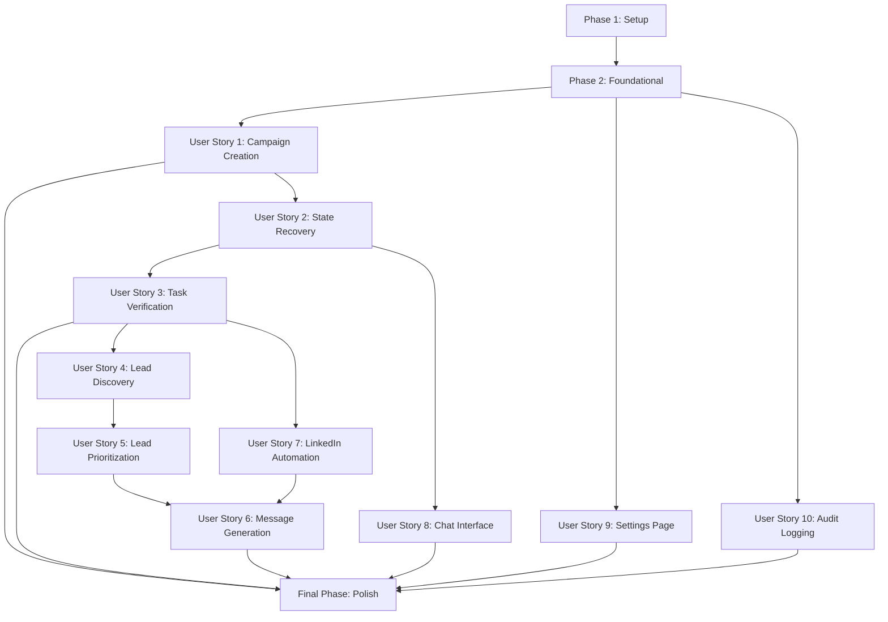

# Tasks: LinkedIn Outreach Copilot Agent

**Input**: Design documents from `/specs/001-linkedin-outreach-copilot/`
**Prerequisites**: plan.md ✅, spec.md ✅, research.md ✅, data-model.md ✅, contracts/ ✅

**Tests**: NOT requested in specification - focusing on implementation tasks only

**Organization**: Tasks grouped by user story to enable independent implementation and testing

---

## Format: `- [ ] [ID] [P?] [Story?] Description`

- **[P]**: Can run in parallel (different files, no dependencies on incomplete tasks)
- **[Story]**: User story label (US1, US2, US3...) for user story phases only
- **File paths**: Exact locations included in task descriptions

---

## Dependencies: User Story Completion Order



**Critical Path**: Setup → Foundation → US1 → US2 → US3 → US4 → US5 → US6

**Parallel Opportunities**:
- After Foundation: US1, US9, US10 can develop concurrently (different components)
- After US2: US3 and US8 can develop in parallel
- After US3: US4 and US7 can develop simultaneously
- US5 depends only on US4 (not blocked by US7)

---

## Parallel Execution Examples

### After Phase 2 (Foundation Complete)
```bash
# Three developers can work simultaneously on:
Developer A: US1 (Campaign entities + services)
Developer B: US9 (Settings UI components)
Developer C: US10 (Audit logging infrastructure)
```

### After US3 (Task Verification Complete)
```bash
# Two developers can work in parallel:
Developer A: US4 (Lead models + Supabase schema)
Developer B: US7 (Playwright MCP integration)
```

---

## Implementation Strategy

**MVP Scope** (Recommended first delivery):
- **User Story 1 only**: Campaign creation with basic CRUD
- Delivers: Ability to create/configure campaigns, save to database, select campaigns
- Value: Foundation for all other features, independently testable
- Estimated: 1-2 weeks for complete story with UI

**Phase 1 Delivery** (After MVP):
- **User Stories 1, 2, 3, 8, 9, 10**: Core architecture + UI
- Delivers: Campaign management, state recovery, task verification, chat interface, settings, audit logs
- Value: Complete deterministic foundation without LinkedIn automation
- Estimated: 3-4 weeks additional

**Phase 2 Delivery** (Full P1):
- **User Stories 4, 5, 6, 7**: LinkedIn outreach features
- Delivers: Lead discovery, prioritization, message generation, LinkedIn automation
- Value: Complete LinkedIn outreach workflow
- Estimated: 3-4 weeks additional

---

## Phase 1: Setup (Shared Infrastructure)

**Purpose**: Project initialization with centralized build configuration and code quality enforcement

- [ ] T001 Create solution file OutreachAgent.sln at repository root with 5 projects (OutreachAgent.Core, OutreachAgent.Agent, OutreachAgent.MCP, OutreachAgent.UI, OutreachAgent.Tests)
- [ ] T002 Create Directory.Build.props at repository root with: LangVersion=12.0, Nullable=enable, TreatWarningsAsErrors=true, AnalysisMode=AllEnabledByDefault, StyleCop.Analyzers package reference, SonarAnalyzer.CSharp package reference
- [ ] T003 [P] Create Directory.Packages.props at repository root with ManagePackageVersionsCentrally=true and version entries for: Microsoft.Maui (10.0.0), Supabase (latest stable), Azure.Security.KeyVault.Secrets (4.8.0), Azure.Monitor.OpenTelemetry (latest), Microsoft.Playwright (1.57.0), xUnit (2.9+)
- [ ] T004 [P] Create .editorconfig at repository root with StyleCop rules: SA1633 (file headers off for now), SA1200 (using directives inside namespace), indentation rules (4 spaces, no tabs)
- [ ] T005 Create src/OutreachAgent.Core/OutreachAgent.Core.csproj with TargetFramework=net10.0, project references prepared
- [ ] T006 [P] Create src/OutreachAgent.Agent/OutreachAgent.Agent.csproj with TargetFramework=net10.0, reference to OutreachAgent.Core
- [ ] T007 [P] Create src/OutreachAgent.MCP/OutreachAgent.MCP.csproj with TargetFramework=net10.0, reference to OutreachAgent.Core
- [ ] T008 [P] Create src/OutreachAgent.UI/OutreachAgent.UI.csproj with TargetFramework=net10.0-windows10.0.19041.0, UseMaui=true, reference to OutreachAgent.Core
- [ ] T009 [P] Create src/OutreachAgent.Tests/OutreachAgent.Tests.csproj with TargetFramework=net10.0, xUnit packages, references to all source projects
- [ ] T010 Verify solution builds successfully with dotnet build and all analyzers active (zero warnings required due to TreatWarningsAsErrors=true)

---

## Phase 2: Foundational (Blocking Prerequisites)

**Purpose**: Core infrastructure that MUST complete before ANY user story implementation

**⚠️ CRITICAL**: No user story work can begin until this phase is complete

- [ ] T011 Create Supabase PostgreSQL schema migration file at database/migrations/001_initial_schema.sql with CREATE TABLE statements for Campaign, Task, Lead, OutreachMessage, AuditLog, EnvironmentSecret per data-model.md
- [ ] T012 Create Supabase enum types in database/migrations/001_initial_schema.sql: CampaignStatus, TaskType, TaskStatus, LeadStatus, MessageType, MessageStatus, LogStatus
- [ ] T013 Create Supabase indexes in database/migrations/001_initial_schema.sql: Campaign(Status, CreatedAt), Task(CampaignId, Status), Lead(CampaignId, LinkedInUrl UNIQUE, Status), AuditLog(TaskId, Timestamp DESC)
- [ ] T014 Create Supabase trigger in database/migrations/001_initial_schema.sql for AuditLog immutability: prevent UPDATE/DELETE operations after Status='completed'
- [ ] T015 [P] Create Azure resource provisioning script at scripts/provision-azure.ps1 with: New-AzResourceGroup, New-AzKeyVault with RBAC roles, New-AzApplicationInsights
- [ ] T016 [P] Create Supabase configuration helper at src/OutreachAgent.Core/Infrastructure/SupabaseConfig.cs with connection string parsing (DATABASE_URL pooled port 6543, DIRECT_URL direct port 5432)
- [ ] T017 [P] Create Azure Key Vault client wrapper at src/OutreachAgent.Core/Infrastructure/KeyVaultClient.cs with DefaultAzureCredential, GetSecretAsync, SetSecretAsync methods, exponential retry policy (2s-16s, 5 retries)
- [ ] T018 [P] Create Application Insights telemetry client at src/OutreachAgent.Core/Infrastructure/TelemetryClient.cs with ActivitySource for custom spans, TrackEvent, TrackException methods
- [ ] T019 Create MCP server lifecycle manager at src/OutreachAgent.MCP/Common/McpServerManager.cs with StartServer, StopServer, RestartServer, VerifyHealth methods for embedded executables
- [ ] T020 Create MCP executable bundling configuration at src/OutreachAgent.UI/Platforms/Windows/mcp-config.json with: Playwright server path, Desktop-Commander server path, SHA256 hash verification entries
- [ ] T021 Implement MCP stdio transport client at src/OutreachAgent.MCP/Common/StdioTransport.cs with JSON-RPC 2.0 request/response handling, timeout management (30s default)
- [ ] T022 Create appsettings.json template at src/OutreachAgent.UI/appsettings.json with: Supabase connection strings (environment variables), Azure Key Vault URI, Application Insights instrumentation key, MCP server config section
- [ ] T023 Verify Supabase schema migration applies successfully with supabase db push command and all tables/indexes/triggers created
- [ ] T024 Verify Azure resources provision successfully with scripts/provision-azure.ps1 and Key Vault/App Insights accessible
- [ ] T025 Verify MCP server lifecycle manager starts/stops Playwright and Desktop-Commander servers successfully

**Checkpoint**: Foundation ready - user story implementation can now begin in parallel

---

## Phase 3: User Story 1 - Campaign Creation and Configuration (Priority: P1) 🎯 MVP

**Goal**: Enable users to create and configure LinkedIn outreach campaigns with database persistence

**Independent Test**: Create campaign through UI → verify saved to Supabase → close app → reopen → confirm campaign persists and can be selected

### Implementation for User Story 1

- [ ] T026 [P] [US1] Create Campaign entity model at src/OutreachAgent.Core/Models/Campaign.cs with properties: Id (Guid), Name (string), Description (string?), CreatedAt, UpdatedAt, Status (CampaignStatus enum), Config (JsonDocument for campaign settings)
- [ ] T027 [P] [US1] Create CampaignStatus enum at src/OutreachAgent.Core/Models/Enums/CampaignStatus.cs with values: Active, Paused, Completed, Archived
- [ ] T028 [P] [US1] Create CampaignConfig model at src/OutreachAgent.Core/Models/CampaignConfig.cs with properties: TargetAudienceDescription, WorkingDirectoryPath, DailyQuota (default 50), SessionDurationHours (default 2)
- [ ] T029 [US1] Create ICampaignRepository interface at src/OutreachAgent.Core/Repositories/ICampaignRepository.cs with methods: CreateAsync, GetByIdAsync, GetAllAsync, UpdateAsync, DeleteAsync
- [ ] T030 [US1] Implement SupabaseCampaignRepository at src/OutreachAgent.Core/Infrastructure/Repositories/SupabaseCampaignRepository.cs using Supabase SDK with connection pooling, JSON serialization for Config column
- [ ] T031 [US1] Create CampaignService at src/OutreachAgent.Core/Services/CampaignService.cs with business logic: CreateCampaignAsync (validation: name required, description min 10 chars, working directory exists and writable), GetCampaignAsync, ListCampaignsAsync, UpdateCampaignAsync
- [ ] T032 [US1] Add validation logic in CampaignService.CreateCampaignAsync: verify working directory exists with Directory.Exists, check write permissions with test file creation, validate Config.DailyQuota ≤ 50, validate Config.SessionDurationHours ≤ 2
- [ ] T033 [US1] Create CampaignListPage.razor at src/OutreachAgent.UI/Pages/CampaignListPage.razor with: campaign list display (name, status, created date), "Create New Campaign" button, "Select Campaign" action per row
- [ ] T034 [US1] Create CreateCampaignDialog.razor component at src/OutreachAgent.UI/Components/CreateCampaignDialog.razor with form fields: Name (required), Target Audience Description (textarea, required, min 10 chars), Working Directory (DirectoryPicker component), Save/Cancel buttons
- [ ] T035 [US1] Create DirectoryPicker.razor component at src/OutreachAgent.UI/Components/DirectoryPicker.razor using MAUI FolderPicker API with validation: directory must exist, must be writable
- [ ] T036 [US1] Implement CreateCampaignDialog.razor submit handler calling CampaignService.CreateCampaignAsync with error handling, success toast notification, navigation to campaign detail page
- [ ] T037 [US1] Create CampaignDetailPage.razor at src/OutreachAgent.UI/Pages/CampaignDetailPage.razor displaying: campaign name, description, target audience, working directory, creation date, status badge, "Edit" and "Delete" buttons
- [ ] T038 [US1] Wire up dependency injection in src/OutreachAgent.UI/MauiProgram.cs: register ICampaignRepository→SupabaseCampaignRepository, CampaignService as scoped services
- [ ] T039 [US1] Create integration test at src/OutreachAgent.Tests/Integration/CampaignServiceTests.cs: CreateCampaignAsync_ValidInput_StoresInSupabase verifying campaign appears in database query after creation
- [ ] T040 [US1] Create UI automation test at src/OutreachAgent.Tests/UI/CampaignCreationTests.cs using Playwright: launch app → click "Create Campaign" → fill form → submit → verify campaign in list

**Checkpoint**: User Story 1 complete - campaigns can be created, configured, and persisted to database independently

---

## Phase 4: User Story 9 - Settings Configuration (Priority: P1)

**Goal**: Provide secure settings page for LinkedIn credentials, working directory, and campaign parameter configuration

**Independent Test**: Access settings → enter credentials → save → verify stored in Key Vault (not local) → restart app → confirm credentials persist

### Implementation for User Story 9

- [ ] T041 [P] [US9] Create IEnvironmentSecretRepository interface at src/OutreachAgent.Core/Repositories/IEnvironmentSecretRepository.cs with methods: StoreSecretAsync (stores Key Vault reference in DB), RetrieveSecretAsync (fetches from Key Vault), ListSecretKeysAsync
- [ ] T042 [P] [US9] Create EnvironmentSecret entity at src/OutreachAgent.Core/Models/EnvironmentSecret.cs with properties: Id (Guid), Key (string - e.g., "LinkedInEmail"), EncryptedValue (string - Key Vault secret URI), KeyVaultSecretName, CreatedAt, UpdatedAt, LastAccessedAt
- [ ] T043 [US9] Implement KeyVaultSecretRepository at src/OutreachAgent.Core/Infrastructure/Repositories/KeyVaultSecretRepository.cs with: StoreSecretAsync (saves to Key Vault, stores URI in Supabase), RetrieveSecretAsync (reads from Key Vault, updates LastAccessedAt)
- [ ] T044 [US9] Create SettingsService at src/OutreachAgent.Core/Services/SettingsService.cs with methods: SaveLinkedInCredentialsAsync (validates non-empty, stores in Key Vault), GetLinkedInCredentialsAsync, UpdateWorkingDirectoryAsync (validates directory exists/writable)
- [ ] T045 [US9] Create SettingsPage.razor at src/OutreachAgent.UI/Pages/SettingsPage.razor with sections: LinkedIn Credentials (email/password inputs with type="password"), Working Directory (DirectoryPicker component), Campaign Selection (dropdown with all campaigns), Save button
- [ ] T046 [US9] Implement SettingsPage.razor LinkedIn credentials section with: InputText for email, InputText type="password" for password, validation messages (required fields), "Save Credentials" button calling SettingsService.SaveLinkedInCredentialsAsync
- [ ] T047 [US9] Add credential validation in SettingsPage.razor: verify Azure Key Vault connectivity before accepting input (call KeyVaultClient.VerifyConnectivityAsync), display clear error if internet unavailable or Key Vault unreachable
- [ ] T048 [US9] Implement SettingsPage.razor campaign selection dropdown: load all campaigns with CampaignService.ListCampaignsAsync, display Name + Status, "Switch Campaign" button updates current campaign in app state, triggers navigation to CampaignDetailPage
- [ ] T049 [US9] Add working directory configuration in SettingsPage.razor: DirectoryPicker component bound to campaign Config.WorkingDirectoryPath, "Update Directory" button calls SettingsService.UpdateWorkingDirectoryAsync with validation
- [ ] T050 [US9] Ensure settings changes take effect immediately: after saving credentials, update in-memory app state (CampaignState service), trigger MCP server restart with new credentials for next agent cycle
- [ ] T051 [US9] Wire up SettingsService in MauiProgram.cs dependency injection with IEnvironmentSecretRepository→KeyVaultSecretRepository registration
- [ ] T052 [US9] Create security validation test at src/OutreachAgent.Tests/Integration/SettingsServiceTests.cs: SaveLinkedInCredentials_ValidInput_StoresInKeyVault_NotLocalStorage verifying credentials never appear in local database or file system
- [ ] T053 [US9] Create UI test at src/OutreachAgent.Tests/UI/SettingsTests.cs: enter credentials → save → close app → reopen → verify credentials persist (without displaying plain text)

**Checkpoint**: User Story 9 complete - settings page functional with secure credential storage in Key Vault

---

## Phase 5: User Story 10 - Audit Logging and Verification (Priority: P1)

**Goal**: Implement comprehensive audit logging with "log before side effect" invariant enforcement

**Independent Test**: Execute any action → verify log entry created with Status='initiated' BEFORE side effect → verify log updated to Status='completed' AFTER side effect

### Implementation for User Story 10

- [ ] T054 [P] [US10] Create AuditLog entity at src/OutreachAgent.Core/Models/AuditLog.cs with properties: Id (Guid), TaskId (Guid?), Timestamp, Action (string - e.g., "ScrapeProfile"), Args (JsonDocument), Result (JsonDocument), Status (LogStatus enum), ErrorMessage (string?)
- [ ] T055 [P] [US10] Create LogStatus enum at src/OutreachAgent.Core/Models/Enums/LogStatus.cs with values: Initiated, Completed, Failed
- [ ] T056 [P] [US10] Create IAuditLogRepository interface at src/OutreachAgent.Core/Repositories/IAuditLogRepository.cs with methods: CreateLogAsync (returns log_id), UpdateLogStatusAsync (sets Status + Result), GetLogsForTaskAsync, GetLogsForCampaignAsync (with filtering)
- [ ] T057 [US10] Implement SupabaseAuditLogRepository at src/OutreachAgent.Core/Infrastructure/Repositories/SupabaseAuditLogRepository.cs with: CreateLogAsync (inserts with Status='Initiated'), UpdateLogStatusAsync (updates Status + Result, validates log exists before update)
- [ ] T058 [US10] Create AuditLogger service at src/OutreachAgent.Core/Services/AuditLogger.cs with methods: LogActionInitiatedAsync (creates log entry, returns log_id), LogActionCompletedAsync (updates log to Completed + Result), LogActionFailedAsync (updates log to Failed + ErrorMessage)
- [ ] T059 [US10] Create invariant enforcer at src/OutreachAgent.Core/Invariants/LogBeforeSideEffectEnforcer.cs with: EnforceAsync method (requires log_id parameter, throws if missing), wrapper methods for common side effects (DatabaseWriteAsync, ToolExecutionAsync)
- [ ] T060 [US10] Integrate AuditLogger into Controller at src/OutreachAgent.Core/Services/Controller.cs: inject IAuditLogRepository, wrap all tool executions with LogActionInitiatedAsync → Execute → LogActionCompletedAsync/LogActionFailedAsync
- [ ] T061 [US10] Add audit log immutability enforcement: update database migration 001_initial_schema.sql with trigger preventing UPDATE/DELETE on AuditLog rows with Status='Completed' or Status='Failed'
- [ ] T062 [US10] Create AuditLogViewerPage.razor at src/OutreachAgent.UI/Pages/AuditLogViewerPage.razor with: filterable table (Task ID, Timestamp, Action, Status), expandable rows showing Args/Result JSON, search by action type, date range filter
- [ ] T063 [US10] Implement AuditLogViewerPage.razor filtering: dropdown for Status (Initiated/Completed/Failed), date range picker (From/To dates), action type search box, "Apply Filters" button calling IAuditLogRepository.GetLogsForCampaignAsync with filters
- [ ] T064 [US10] Add audit log summary statistics to AuditLogViewerPage.razor: total actions attempted, success rate percentage, most common errors (grouped by ErrorMessage), timeline chart (actions per hour)
- [ ] T065 [US10] Wire up AuditLogger and IAuditLogRepository in MauiProgram.cs dependency injection
- [ ] T066 [US10] Create invariant enforcement test at src/OutreachAgent.Tests/Unit/LogBeforeSideEffectEnforcerTests.cs: EnforceAsync_WithoutLogId_ThrowsInvalidOperationException verifying side effects cannot occur without prior log entry
- [ ] T067 [US10] Create integration test at src/OutreachAgent.Tests/Integration/AuditLoggerTests.cs: LogActionInitiatedAsync_ThenSideEffect_ThenLogActionCompletedAsync verifying correct log status progression and timestamps

**Checkpoint**: User Story 10 complete - audit logging infrastructure functional with invariant enforcement

---

## Phase 6: User Story 2 - Deterministic Execution Cycle with State Recovery (Priority: P1)

**Goal**: Enable Controller to reload campaign state from database at every cycle, ensuring continuation without conversation history

**Independent Test**: Start campaign → perform actions creating tasks/artifacts → close app → delete chat history → reopen → verify Controller resumes with complete state awareness

### Implementation for User Story 2

- [ ] T068 [US2] Create IStateRepository interface at src/OutreachAgent.Core/Repositories/IStateRepository.cs with method: LoadCampaignStateAsync (returns CampaignState aggregate)
- [ ] T069 [US2] Create CampaignState aggregate model at src/OutreachAgent.Core/Models/CampaignState.cs with properties: Campaign (Campaign entity), Tasks (List<Task>), Leads (List<Lead>), RecentAuditLogs (List<AuditLog> - last 50 entries), AvailableTools (string[] - from MCP server status)
- [ ] T070 [US2] Implement SupabaseStateRepository at src/OutreachAgent.Core/Infrastructure/Repositories/SupabaseStateRepository.cs with: LoadCampaignStateAsync (queries Campaign, Tasks, Leads, AuditLogs with JOIN operations, constructs CampaignState object)
- [ ] T071 [US2] Create Controller service at src/OutreachAgent.Core/Services/Controller.cs with: ExecuteCycleAsync method (reloads state, validates invariants, invokes agent, validates proposal, executes action, logs result)
- [ ] T072 [US2] Implement Controller.ExecuteCycleAsync state reload logic: call IStateRepository.LoadCampaignStateAsync at cycle start, construct state snapshot for agent prompt, verify no in-memory state carried over from previous cycle
- [ ] T073 [US2] Create state snapshot serializer at src/OutreachAgent.Core/Services/StateSnapshotBuilder.cs with: BuildSnapshotAsync (constructs JSON payload for agent prompt per agent-contract.md format: campaign context, task list, lead list, audit log summary, available tools, constraints)
- [ ] T074 [US2] Implement StateSnapshotBuilder.BuildSnapshotAsync: serialize CampaignState to JSON with rate limit constraints (dailyQuota - actions today, sessionDurationHours - current session elapsed time), prioritized task list (pending tasks sorted by priority_order)
- [ ] T075 [US2] Add state verification logging in Controller.ExecuteCycleAsync: log state reload timestamp, task count, lead count, recent audit log count to Application Insights with custom ActivitySource span
- [ ] T076 [US2] Create state recovery test scenario at src/OutreachAgent.Tests/Integration/StateRecoveryTests.cs: create campaign → create task → close app simulation (clear in-memory state) → reload state → verify all entities present with correct statuses
- [ ] T076b [US2] Implement state integrity validator at src/OutreachAgent.Core/Services/StateIntegrityValidator.cs: ValidateStateAsync method checks for orphaned records (tasks without campaigns, leads without campaigns), incomplete tasks with logged side effects (Status=InProgress but side effects exist), corrupted JSONB data in Config/Input/Output columns, returns validation result with list of issues
- [ ] T077 [US2] Create cross-session recovery test at src/OutreachAgent.Tests/Integration/CrossSessionRecoveryTests.cs: perform 10 actions → stop app → clear conversation history simulation → resume → verify Controller proposes next logical action based on DB state only
- [ ] T078 [US2] Integrate Controller into UI: create ControllerService wrapper in src/OutreachAgent.UI/Services/ControllerService.cs calling Controller.ExecuteCycleAsync on user message submit, displaying Controller status messages in chat

**Checkpoint**: User Story 2 complete - state recovery functional, Controller can resume campaigns without conversation history

---

## Phase 7: User Story 8 - Chat Interface for Agent Interaction (Priority: P1)

**Goal**: Provide chat UI for user-agent interaction with message display, file upload, status updates

**Independent Test**: Launch app → type message → receive response → upload file → verify file in working directory → scroll chat history

### Implementation for User Story 8

- [ ] T079 [P] [US8] Create ChatMessage model at src/OutreachAgent.UI/Models/ChatMessage.cs with properties: Id (Guid), Sender (enum: User/Agent/System), Content (string), Timestamp, MessageType (enum: Text/File/Status)
- [ ] T080 [P] [US8] Create IChatService interface at src/OutreachAgent.UI/Services/IChatService.cs with methods: SendMessageAsync (user input), ReceiveMessageAsync (agent response), UploadFileAsync, GetChatHistoryAsync, ClearChatHistoryAsync
- [ ] T081 [US8] Implement ChatService at src/OutreachAgent.UI/Services/ChatService.cs with: SendMessageAsync (calls ControllerService.ExecuteCycleAsync, returns agent response), in-memory message storage (List<ChatMessage>), ClearChatHistoryAsync (clears list without affecting DB state)
- [ ] T082 [US8] Create ChatPage.razor at src/OutreachAgent.UI/Pages/ChatPage.razor with: message list display (scrollable), message input box (multi-line textarea), "Send" button, file upload button, "Clear History" button (with confirmation dialog)
- [ ] T083 [US8] Implement ChatPage.razor message list: display messages in chronological order, user messages aligned right with blue background, agent messages aligned left with gray background, system status messages centered with italic text
- [ ] T084 [US8] Create ChatMessageComponent.razor at src/OutreachAgent.UI/Components/ChatMessageComponent.razor with: message bubble styling, timestamp display (formatted as "HH:mm"), sender label (User/Agent/System), markdown rendering for agent responses
- [ ] T085 [US8] Implement ChatPage.razor message input: InputTextArea bound to currentMessage string, "Send" button triggers ChatService.SendMessageAsync, Enter key submits (Shift+Enter for new line), auto-scroll to bottom on new message
- [ ] T086 [US8] Add file upload functionality in ChatPage.razor: InputFile component with "📎 Upload" button, validate file size (max 10MB per quickstart.md), call ChatService.UploadFileAsync copying file to campaign WorkingDirectoryPath, display uploaded file name in chat
- [ ] T087 [US8] Implement status message display in ChatPage.razor: subscribe to ControllerService status events (e.g., "Executing LinkedIn search..."), display as system messages with spinner icon, remove spinner when action completes
- [ ] T088 [US8] Add "Clear History" functionality: button with confirmation dialog ("This will clear chat display but will NOT affect campaign state. Continue?"), calls ChatService.ClearChatHistoryAsync, empties message list UI
- [ ] T089 [US8] Ensure chat output never exposes sensitive data: create output sanitizer in ChatService.ReceiveMessageAsync filtering environment variables (regex: /[A-Z_]+=(.*)/), credentials (regex: /password|token|key|secret/i), internal tool names (replace "playwright" with "LinkedIn automation")
- [ ] T090 [US8] Wire up ChatService and IChatService in MauiProgram.cs dependency injection as singleton (maintains chat history within app session)
- [ ] T091 [US8] Create UI test at src/OutreachAgent.Tests/UI/ChatInterfaceTests.cs: type message → verify appears in chat → receive agent response → verify displayed → upload file → verify file in working directory
- [ ] T092 [US8] Create chat history independence test at src/OutreachAgent.Tests/Integration/ChatHistoryIndependenceTests.cs: perform actions → clear chat → send new message → verify agent response references DB state not prior messages

**Checkpoint**: User Story 8 complete - chat interface functional with message display, file upload, and status updates

---

## Phase 8: User Story 3 - Task Management with Verification (Priority: P1)

**Goal**: Implement task creation, dependency management, and completion verification with side effect validation

**Independent Test**: Create campaign → observe task generation → complete task → verify status only changes after side effects confirmed in DB

### Implementation for User Story 3

- [ ] T093 [P] [US3] Create Task entity at src/OutreachAgent.Core/Models/Task.cs with properties: Id (Guid), CampaignId (Guid FK), LeadId (Guid? FK), Type (TaskType enum), Status (TaskStatus enum), CreatedAt, CompletedAt (nullable), Input (JsonDocument), Output (JsonDocument), ErrorMessage (string?)
- [ ] T094 [P] [US3] Create TaskType enum at src/OutreachAgent.Core/Models/Enums/TaskType.cs with values: ScrapeProfile, SendConnectionRequest, SendFollowUp, GenerateMessage, PrioritizeLead, AnalyzeCampaign
- [ ] T095 [P] [US3] Create TaskStatus enum at src/OutreachAgent.Core/Models/Enums/TaskStatus.cs with values: Pending, InProgress, Completed, Failed, Blocked (dependencies not met)
- [ ] T096 [US3] Create ITaskRepository interface at src/OutreachAgent.Core/Repositories/ITaskRepository.cs with methods: CreateTaskAsync, GetTaskByIdAsync, GetTasksForCampaignAsync, UpdateTaskStatusAsync (with side effect validation), GetBlockedTasksAsync (tasks with unmet dependencies)
- [ ] T097 [US3] Implement SupabaseTaskRepository at src/OutreachAgent.Core/Infrastructure/Repositories/SupabaseTaskRepository.cs with: CreateTaskAsync (validates dependencies exist), UpdateTaskStatusAsync (enforces status transitions: Pending→InProgress→Completed/Failed), GetBlockedTasksAsync (queries tasks with dependencies WHERE dependency status != Completed)
- [ ] T098 [US3] Create TaskService at src/OutreachAgent.Core/Services/TaskService.cs with: CreateTaskAsync (validates campaign exists, validates input JSON), GetNextTaskAsync (returns highest priority Pending task with no blocking dependencies), CompleteTaskAsync (validates side effects exist before status update)
- [ ] T099 [US3] Implement task verification logic in TaskService.CompleteTaskAsync: check side effects based on TaskType (ScrapeProfile → verify Lead record exists with scraped data, SendConnectionRequest → verify OutreachMessage record exists with Status='Sent'), reject completion if verification fails
- [ ] T100 [US3] Create dependency validator at src/OutreachAgent.Core/Services/TaskDependencyValidator.cs with: ValidateDependenciesMetAsync (checks all prerequisite tasks have Status='Completed'), GetBlockedTasksAsync (returns tasks that cannot proceed due to dependencies)
- [ ] T101 [US3] Integrate TaskService into Controller.ExecuteCycleAsync: call TaskService.GetNextTaskAsync to determine current task, pass to agent in state snapshot, after action execution call TaskService.CompleteTaskAsync with side effect verification
- [ ] T101b [US3] Implement agent task generation in Controller.ExecuteCycleAsync: when campaign starts (no tasks exist), construct prompt for agent to analyze campaign context and propose initial task breakdown, validate agent's task proposals, call TaskService.CreateTaskAsync for each proposed task
- [ ] T102 [US3] Add task state logging: in Controller.ExecuteCycleAsync, log task transitions to audit log (Pending→InProgress, InProgress→Completed, InProgress→Failed) with TaskService.UpdateTaskStatusAsync triggering AuditLogger.LogActionInitiatedAsync
- [ ] T103 [US3] Create TaskListComponent.razor at src/OutreachAgent.UI/Components/TaskListComponent.razor displaying: task description, status badge (color-coded: Pending=gray, InProgress=blue, Completed=green, Failed=red, Blocked=orange), created timestamp, "View Details" button
- [ ] T104 [US3] Implement TaskListComponent.razor filtering: dropdown for Status filter (All/Pending/InProgress/Completed/Failed/Blocked), sort by priority or created date, display dependencies for each task with status icons
- [ ] T105 [US3] Create TaskDetailDialog.razor at src/OutreachAgent.UI/Components/TaskDetailDialog.razor showing: task type, status, input JSON (formatted), output JSON (formatted), error message (if failed), audit log entries for this task, "Retry" button (if failed)
- [ ] T106 [US3] Wire up TaskService and ITaskRepository in MauiProgram.cs dependency injection
- [ ] T107 [US3] Create task verification test at src/OutreachAgent.Tests/Unit/TaskServiceTests.cs: CompleteTaskAsync_WithoutSideEffectVerification_ThrowsInvalidOperationException ensuring tasks cannot be marked complete without proof
- [ ] T108 [US3] Create task dependency test at src/OutreachAgent.Tests/Integration/TaskDependencyTests.cs: create task with dependency → attempt execution → verify blocked → complete dependency → verify unblocked
- [ ] T109 [US3] Create end-to-end task flow test at src/OutreachAgent.Tests/Integration/TaskFlowTests.cs: create campaign → tasks generated → execute tasks sequentially → verify each completes only after side effects confirmed

**Checkpoint**: User Story 3 complete - task management functional with verification and dependency handling

---

## Phase 9: User Story 7 - LinkedIn Automation with Playwright (Priority: P2)

**Goal**: Integrate Playwright MCP server for LinkedIn browser automation with rate limiting and anti-detection

**Independent Test**: Configure LinkedIn credentials → initiate search action → verify Playwright executes in browser → verify rate limits enforced

### Implementation for User Story 7

- [ ] T110 [P] [US7] Create ILinkedInAutomationService interface at src/OutreachAgent.MCP/Contracts/ILinkedInAutomationService.cs with methods: LoginAsync, SearchProfilesAsync, ScrapeProfileAsync, SendConnectionRequestAsync, SendMessageAsync
- [ ] T111 [P] [US7] Create LinkedInCredentials model at src/OutreachAgent.MCP/Models/LinkedInCredentials.cs with properties: Email (string), Password (string - retrieved from Key Vault), SessionCookies (string - for session persistence)
- [ ] T112 [US7] Implement PlaywrightLinkedInService at src/OutreachAgent.MCP/Services/PlaywrightLinkedInService.cs with: LoginAsync (navigates to linkedin.com/login, fills credentials, handles 2FA/CAPTCHA detection), SearchProfilesAsync (executes search query, extracts profile URLs from results)
- [ ] T113 [US7] Implement PlaywrightLinkedInService.ScrapeProfileAsync: navigate to profile URL, extract fields per linkedin-tools.md contract (name, title, company, location, experience), return structured JSON, log action to audit log before/after
- [ ] T114 [US7] Implement PlaywrightLinkedInService.SendConnectionRequestAsync: navigate to profile, click "Connect" button, enter personalized message (from OutreachMessage.Body), submit, wait for confirmation, handle errors (already connected, pending request)
- [ ] T115 [US7] Create rate limiter at src/OutreachAgent.MCP/Services/LinkedInRateLimiter.cs with: EnforceDelayAsync (adaptive delays: 30-90s for connection requests, 5-15s for profile views), CheckDailyQuotaAsync (queries audit log for today's actions, enforces 50 connections/day, 100 views/day limits)
- [ ] T116 [US7] Integrate rate limiter into PlaywrightLinkedInService: before each action, call LinkedInRateLimiter.CheckDailyQuotaAsync (throw QuotaExceededException if limit reached), call EnforceDelayAsync with variable delay using Random (30-90s range), log delay duration to Application Insights
- [ ] T117 [US7] Add session management in PlaywrightLinkedInService: persist session cookies to database after successful login (in EnvironmentSecret table with Key="LinkedInSessionCookies"), reuse cookies on subsequent LoginAsync calls (skip login form if cookies valid), detect cookie expiration and re-login
- [ ] T118 [US7] Create anti-detection patterns in PlaywrightLinkedInService: randomize mouse movements with Playwright.Mouse.MoveAsync, add typing delays (100-300ms between keystrokes) with Page.TypeAsync options, randomize scroll behavior with Page.EvaluateAsync("window.scrollTo(...)") with variable delays
- [ ] T119 [US7] Implement CAPTCHA detection in PlaywrightLinkedInService: check for CAPTCHA challenge after login (Locator("iframe[title*='CAPTCHA']")), pause automation if detected, log CaptchaDetected event to audit log, display notification to user ("LinkedIn CAPTCHA detected, please solve manually")
- [ ] T120 [US7] Add LinkedIn restriction detection: check for rate limit warning page (Locator("text='Too many requests'")), detect account restriction page, pause campaign if detected, log AccountRestricted event, notify user with recovery instructions
- [ ] T121 [US7] Wire up ILinkedInAutomationService→PlaywrightLinkedInService in MauiProgram.cs dependency injection with singleton scope (maintains browser session across cycles)
- [ ] T122 [US7] Create Playwright integration test at src/OutreachAgent.Tests/Integration/PlaywrightLinkedInTests.cs: LoginAsync_ValidCredentials_ReturnsSuccess (uses test LinkedIn account), ScrapeProfileAsync_ValidUrl_ReturnsProfileData
- [ ] T123 [US7] Create rate limiter test at src/OutreachAgent.Tests/Unit/LinkedInRateLimiterTests.cs: EnforceDelayAsync_AfterConnectionRequest_WaitsMinimum30Seconds verifying adaptive delays
- [ ] T124 [US7] Create quota enforcement test at src/OutreachAgent.Tests/Integration/QuotaEnforcementTests.cs: perform 50 connection requests → verify 51st throws QuotaExceededException → wait until midnight UTC → verify quota resets

**Checkpoint**: User Story 7 complete - LinkedIn automation functional with Playwright MCP integration and rate limiting

---

## Phase 10: User Story 4 - LinkedIn Profile Discovery and Lead Collection (Priority: P2)

**Goal**: Automate LinkedIn search, extract profile data, store as leads in database

**Independent Test**: Create campaign with target criteria → execute lead discovery → verify leads saved to database with profile information

### Implementation for User Story 4

- [ ] T125 [P] [US4] Create Lead entity at src/OutreachAgent.Core/Models/Lead.cs with properties: Id (Guid), CampaignId (Guid FK), Name (string), LinkedInUrl (string - unique per campaign), Email (string?), ProfileData (JsonDocument - stores all scraped fields), ScrapedAt, Status (LeadStatus enum), CreatedAt, UpdatedAt
- [ ] T126 [P] [US4] Create LeadStatus enum at src/OutreachAgent.Core/Models/Enums/LeadStatus.cs with values: New, Contacted, Connected, Replied, Qualified, Disqualified
- [ ] T127 [P] [US4] Create ProfileData model at src/OutreachAgent.Core/Models/ProfileData.cs with properties: Name, Title, Company (object with name/url/size), Location, Experience (array), Education (array), Skills (array), Notes (extracted keywords matching campaign)
- [ ] T128 [US4] Create ILeadRepository interface at src/OutreachAgent.Core/Repositories/ILeadRepository.cs with methods: CreateLeadAsync (enforces unique LinkedInUrl per campaign), GetLeadByUrlAsync, GetLeadsForCampaignAsync (with pagination), UpdateLeadAsync, CheckDuplicateAsync
- [ ] T129 [US4] Implement SupabaseLeadRepository at src/OutreachAgent.Core/Infrastructure/Repositories/SupabaseLeadRepository.cs with: CreateLeadAsync (INSERT with ON CONFLICT(campaign_id, linkedin_url) DO UPDATE to handle duplicates), GetLeadsForCampaignAsync (paginated query with LIMIT/OFFSET, default 50 per page)
- [ ] T130 [US4] Create LeadService at src/OutreachAgent.Core/Services/LeadService.cs with: CollectLeadAsync (validates LinkedIn URL format, calls Playwright scrape, saves to DB), GetLeadsAsync (returns paginated list), CheckDuplicateAsync (queries by URL)
- [ ] T131 [US4] Implement LeadService.CollectLeadAsync logic: call ILeadRepository.CheckDuplicateAsync first, if exists return existing lead (no re-scrape), if new call ILinkedInAutomationService.ScrapeProfileAsync, construct ProfileData object, call ILeadRepository.CreateLeadAsync
- [ ] T132 [US4] Add lead collection task generation in Controller.ExecuteCycleAsync: when campaign starts, agent proposes CreateTask(Type=ScrapeProfile) for target audience, Controller creates batch of ScrapeProfile tasks (up to 100 profiles from search results)
- [ ] T133 [US4] Create LinkedIn search integration: in PlaywrightLinkedInService.SearchProfilesAsync, navigate to linkedin.com/search/people, apply filters from campaign Config (keywords, location, company size), extract profile URLs from search results (up to 100 per search), return List<string> of profile URLs
- [ ] T134 [US4] Handle search pagination in PlaywrightLinkedInService.SearchProfilesAsync: iterate through result pages (click "Next" button), enforce rate limiting between pages (5-15s delay), stop at daily quota or max 100 results
- [ ] T135 [US4] Create LeadListComponent.razor at src/OutreachAgent.UI/Components/LeadListComponent.razor with: paginated table (Name, Title, Company, Status, Scraped Date), 50 leads per page with prev/next buttons, "View Profile" button (opens LinkedIn URL), "Contact" button (initiates outreach task)
- [ ] T136 [US4] Implement LeadListComponent.razor filtering: search by name/company, filter by Status dropdown, sort by Scraped Date or Priority Score (added in Story 5), display total lead count and current page info
- [ ] T137 [US4] Create LeadDetailDialog.razor at src/OutreachAgent.UI/Components/LeadDetailDialog.razor showing: full ProfileData JSON (formatted), scraped date, status history, associated tasks (ScrapeProfile, SendConnectionRequest), "Update Status" button
- [ ] T138 [US4] Wire up LeadService and ILeadRepository in MauiProgram.cs dependency injection
- [ ] T139 [US4] Create lead collection test at src/OutreachAgent.Tests/Integration/LeadCollectionTests.cs: execute search → scrape profiles → verify leads in database with ProfileData populated
- [ ] T140 [US4] Create duplicate detection test at src/OutreachAgent.Tests/Unit/LeadServiceTests.cs: CollectLeadAsync_DuplicateUrl_UpdatesExistingLead verifying no duplicate lead entries

**Checkpoint**: User Story 4 complete - lead discovery and collection functional

---

## Phase 11: User Story 5 - Lead Prioritization (Priority: P2)

**Goal**: Calculate priority scores for leads based on weighted heuristics and campaign goals

**Independent Test**: Collect leads with varying profiles → run prioritization → verify leads ranked by score → view reasoning

### Implementation for User Story 5

- [ ] T141 [P] [US5] Add PriorityScore and PriorityReasoning columns to Lead entity: PriorityScore (float 0-100), PriorityReasoning (string - explanation of score calculation)
- [ ] T142 [P] [US5] Create PrioritizationWeights model at src/OutreachAgent.Core/Models/PrioritizationWeights.cs with properties: HeadlineKeywordMatch (default 0.30), CompanySizeMatch (default 0.25), SeniorityLevel (default 0.25), LocationRelevance (default 0.10), ProfileActivityIndicators (default 0.10) - stored in Campaign Config
- [ ] T143 [US5] Create ILeadPrioritizationService interface at src/OutreachAgent.Core/Services/ILeadPrioritizationService.cs with method: CalculatePriorityScoreAsync (takes Lead + Campaign, returns score + reasoning)
- [ ] T144 [US5] Implement LeadPrioritizationService at src/OutreachAgent.Core/Services/LeadPrioritizationService.cs with: CalculatePriorityScoreAsync (applies weighted heuristics from PrioritizationWeights, returns score 0-100)
- [ ] T145 [US5] Implement headline keyword matching in LeadPrioritizationService: extract keywords from Campaign.Config.TargetAudienceDescription (split by space, filter common words), check ProfileData.Title for keyword matches (case-insensitive), calculate match percentage (matched keywords / total keywords), multiply by HeadlineKeywordMatch weight (default 30%)
- [ ] T146 [US5] Implement company size matching: extract target company size from campaign description (regex: /(\d+)-(\d+) employees/), parse ProfileData.Company.Size (e.g., "100-200 employees"), calculate match score (0-100 based on overlap), multiply by CompanySizeMatch weight (default 25%)
- [ ] T147 [US5] Implement seniority level scoring: assign scores to job titles (Director/VP/CTO=100, Manager/Lead=75, Senior=50, Mid=25, Junior=10), parse ProfileData.Title for seniority indicators, multiply by SeniorityLevel weight (default 25%)
- [ ] T148 [US5] Implement location relevance: extract target location from campaign description, compare with ProfileData.Location (exact match=100, same country=50, different=0), multiply by LocationRelevance weight (default 10%)
- [ ] T149 [US5] Implement activity indicators: check ProfileData for recent posts (ScrapedAt within 30 days), LinkedIn "Open to Work" badge, profile completeness (all fields filled=100, partial=50), multiply by ProfileActivityIndicators weight (default 10%)
- [ ] T150 [US5] Create prioritization reasoning builder in LeadPrioritizationService: generate text explanation (e.g., "Score: 87/100. Headline keywords matched (CTO, SaaS): +30. Company size 50-200 matches target: +25. Director-level seniority: +25. Location Ukraine matches target: +10. Active profile (recent posts): +7."), store in Lead.PriorityReasoning
- [ ] T151 [US5] Integrate prioritization into LeadService.CollectLeadAsync: after saving lead, call ILeadPrioritizationService.CalculatePriorityScoreAsync, update Lead.PriorityScore and Lead.PriorityReasoning with ILeadRepository.UpdateLeadAsync
- [ ] T152 [US5] Add batch prioritization endpoint in LeadService: PrioritizeAllLeadsAsync (re-calculates scores for all leads in campaign, useful after changing PrioritizationWeights in campaign config)
- [ ] T153 [US5] Update LeadListComponent.razor: add PriorityScore column (sortable DESC by default), display score as badge (0-40=red, 41-70=orange, 71-100=green), "View Reasoning" button showing PriorityReasoning in tooltip
- [ ] T154 [US5] Add priority score chart to CampaignDetailPage.razor: bar chart showing lead distribution by score ranges (0-20, 21-40, 41-60, 61-80, 81-100), total leads per range
- [ ] T155 [US5] Wire up ILeadPrioritizationService→LeadPrioritizationService in MauiProgram.cs dependency injection
- [ ] T156 [US5] Create prioritization test at src/OutreachAgent.Tests/Unit/LeadPrioritizationServiceTests.cs: CalculatePriorityScoreAsync_CTOWithKeywordMatch_ReturnsHighScore verifying scoring logic
- [ ] T157 [US5] Create prioritization reasoning test at src/OutreachAgent.Tests/Integration/PrioritizationReasoningTests.cs: verify reasoning text includes all factors (headline, company, seniority, location, activity) with scores

**Checkpoint**: User Story 5 complete - lead prioritization functional with weighted heuristics and reasoning

---

## Phase 12: User Story 6 - Outreach Message Generation (Priority: P2)

**Goal**: Generate personalized LinkedIn messages in Ukrainian using LLM agent based on lead profiles and campaign context

**Independent Test**: Select lead → request message generation → verify message in Ukrainian, personalized with lead details, within character limits

### Implementation for User Story 6

- [ ] T158 [P] [US6] Create OutreachMessage entity at src/OutreachAgent.Core/Models/OutreachMessage.cs with properties: Id (Guid), TaskId (Guid FK), LeadId (Guid FK), Type (MessageType enum), Status (MessageStatus enum), Subject (string?), Body (string), SentAt (nullable), Metadata (JsonDocument)
- [ ] T159 [P] [US6] Create MessageType enum at src/OutreachAgent.Core/Models/Enums/MessageType.cs with values: ConnectionRequest, FollowUp, InMail
- [ ] T160 [P] [US6] Create MessageStatus enum at src/OutreachAgent.Core/Models/Enums/MessageStatus.cs with values: Draft, Sent, Failed, Delivered (if tracking available)
- [ ] T161 [US6] Create IOutreachMessageRepository interface at src/OutreachAgent.Core/Repositories/IOutreachMessageRepository.cs with methods: CreateMessageAsync, GetMessageByIdAsync, GetMessagesForLeadAsync, UpdateMessageStatusAsync
- [ ] T162 [US6] Implement SupabaseOutreachMessageRepository at src/OutreachAgent.Core/Infrastructure/Repositories/SupabaseOutreachMessageRepository.cs with standard CRUD operations
- [ ] T163 [US6] Create IMessageGenerationService interface at src/OutreachAgent.Core/Services/IMessageGenerationService.cs with methods: GenerateConnectionRequestAsync (returns message string ≤300 chars), GenerateFollowUpAsync (returns message string ≤1000 chars)
- [ ] T164 [US6] Implement LlmMessageGenerationService at src/OutreachAgent.Core/Services/LlmMessageGenerationService.cs with: GenerateConnectionRequestAsync (calls agent with prompt: "Generate Ukrainian connection request for {lead profile}, campaign context {campaign description}, max 300 chars, warm tone, no sales pitch")
- [ ] T165 [US6] Create message generation prompt template at src/OutreachAgent.Core/Prompts/MessageGenerationPrompt.cs with: system prompt (Ukrainian language, warm professional tone, personalization guidelines), user prompt template (campaign context + lead profile + message type + character limit)
- [ ] T166 [US6] Implement LlmMessageGenerationService.GenerateConnectionRequestAsync: construct prompt with lead ProfileData (Name, Title, Company), campaign context, call agent API with temperature=0.7 (higher creativity), validate response length ≤300 chars, retry if too long (with "make it shorter" instruction)
- [ ] T167 [US6] Implement LlmMessageGenerationService.GenerateFollowUpAsync: similar to connection request but with longer limit (1000 chars), include value proposition details from campaign context, add call-to-action (e.g., "Можемо обговорити на дзвінку?")
- [ ] T168 [US6] Add message personalization validation: ensure generated message includes at least one specific detail from lead profile (name, company, or title mentioned), reject generic messages that could apply to anyone, retry generation with "add more personalization" instruction if validation fails
- [ ] T169 [US6] Create Ukrainian language validator: check generated message contains Ukrainian characters (Cyrillic), verify warm greeting (Привіт, Доброго дня, etc.), ensure professional tone (no slang or overly casual language), use regex or simple heuristics
- [ ] T170 [US6] Integrate message generation into task flow: when agent proposes CreateTask(Type=GenerateMessage), Controller calls IMessageGenerationService.GenerateConnectionRequestAsync, creates OutreachMessage record with Status=Draft, stores in database
- [ ] T171 [US6] Create MessageReviewDialog.razor at src/OutreachAgent.UI/Components/MessageReviewDialog.razor with: message text display (editable TextArea), lead profile summary, character count indicator (turns red if >300 for connection requests), "Approve"/"Regenerate"/"Edit" buttons
- [ ] T172 [US6] Implement MessageReviewDialog.razor "Regenerate" button: calls IMessageGenerationService with same parameters, displays new message, allows multiple regenerations until user approves
- [ ] T173 [US6] Add message approval flow: "Approve" button updates OutreachMessage.Status to Approved (ready for sending), creates SendConnectionRequest task, links Task.Id to OutreachMessage.TaskId
- [ ] T174 [US6] Update LeadDetailDialog.razor: add "Generate Message" button calling IMessageGenerationService, display all generated messages for lead with statuses (Draft/Approved/Sent)
- [ ] T175 [US6] Wire up IMessageGenerationService→LlmMessageGenerationService and IOutreachMessageRepository in MauiProgram.cs dependency injection
- [ ] T176 [US6] Create message generation test at src/OutreachAgent.Tests/Integration/MessageGenerationTests.cs: GenerateConnectionRequestAsync_ValidLead_ReturnsUkrainianMessage verifying language and length constraints
- [ ] T177 [US6] Create personalization test at src/OutreachAgent.Tests/Unit/MessageGenerationServiceTests.cs: verify generated message includes lead name or company (not generic)

**Checkpoint**: User Story 6 complete - message generation functional with Ukrainian language and personalization

---

## Phase 13: Final - Polish & Cross-Cutting Concerns

**Purpose**: Application-wide improvements, error handling, performance optimization, deployment preparation

- [ ] T178 [P] Add global error handling middleware in src/OutreachAgent.UI/MauiProgram.cs: configure unhandled exception handler, log to Application Insights with TelemetryClient.TrackException, display user-friendly error dialog
- [ ] T179 [P] Add loading indicators across all pages: spinner overlay during async operations (campaign creation, task execution, lead scraping), progress bar for batch operations (lead prioritization, search execution)
- [ ] T180 [P] Implement toast notifications in src/OutreachAgent.UI/Services/ToastService.cs: success messages (green), error messages (red), info messages (blue), configurable duration (default 3s)
- [ ] T181 [P] Add offline detection: monitor network connectivity with Connectivity.NetworkAccess, display banner when offline, pause MCP server operations requiring internet (Key Vault, Supabase), queue operations for retry when online
- [ ] T182 [P] Create application startup splash screen at src/OutreachAgent.UI/Resources/Splash/splash.svg with logo and loading indicator
- [ ] T183 Optimize Supabase queries: add composite indexes (Campaign + Status, Lead + CampaignId + PriorityScore DESC), implement query result caching for frequently accessed data (campaign config, environment secrets), use SELECT specific columns instead of SELECT *
- [ ] T184 Implement lazy loading for lead list: load 50 leads initially, load next 50 on scroll to bottom (infinite scroll pattern), prefetch next page in background for smooth UX
- [ ] T185 Add Application Insights custom events: track campaign creation (with target audience hash), task completion rate per campaign, average priority score per campaign, daily quota usage (connection requests/profile views), message generation success rate
- [ ] T186 Create distributed tracing for MCP tool calls: wrap all ILinkedInAutomationService calls with ActivitySource spans, include parameters (profile URL, action type), track duration and success/failure, correlate with audit log entries
- [ ] T187 Add performance monitoring: track ChatPage.razor render time, measure Controller.ExecuteCycleAsync duration, monitor Supabase query latency, alert if startup time >3s or UI response >100ms
- [ ] T188 [P] Create deployment package: configure MAUI single-file publish, include MCP server executables in bundle, create Windows installer with WiX or NSIS, include uninstaller
- [ ] T189 [P] Create user documentation at docs/user-guide.md: getting started, campaign creation walkthrough, LinkedIn credential setup, understanding priority scores, troubleshooting common issues (CAPTCHA, rate limits, connection errors)
- [ ] T190 [P] Create developer documentation at docs/developer-guide.md: architecture overview, controller-agent pattern explanation, adding new task types, extending lead prioritization, contributing guidelines
- [ ] T191 Add health check endpoint for MCP servers: implement McpServerManager.HealthCheckAsync pinging each server, display server status in SettingsPage.razor (green=healthy, red=unhealthy), "Restart Server" button for manual recovery
- [ ] T192 Create database backup script at scripts/backup-supabase.ps1: export campaign data to JSON, store in working directory with timestamp, schedule automatic backups daily
- [ ] T193 Add data export functionality: "Export Campaign" button in CampaignDetailPage.razor generating CSV with all leads, tasks, messages for offline analysis or backup
- [ ] T194 Implement feature flags in appsettings.json: enable/disable Application Insights telemetry, enable/disable MCP server auto-start, enable/disable adaptive rate limiting (for testing with fixed delays)
- [ ] T195 Create smoke test suite at src/OutreachAgent.Tests/Smoke/SmokeTests.cs: verify app launches successfully, campaign creation works, settings page loads, chat interface responds, MCP servers start
- [ ] T195b [P] Implement system tray integration at src/OutreachAgent.UI/Platforms/Windows/SystemTrayService.cs: create system tray icon with context menu (Show/Hide, Exit), minimize to tray on window close, restore from tray on icon click, show notification badges for campaign status (optional per FR-073)
- [ ] T196 Run full constitution compliance check: verify Directory.Build.props configured, verify Directory.Packages.props centralized, verify .editorconfig rules enforced, verify TDD workflow followed (tests exist for all features), verify desktop-first optimization (1920x1080 layouts)
- [ ] T197 Create release notes at CHANGELOG.md: document all user stories delivered, known limitations (CAPTCHA requires manual intervention, 50/day quota), breaking changes (none for v1.0), migration guide (none for fresh install)

**Checkpoint**: Application polished and ready for deployment

---

## Task Execution Summary

**Total Tasks**: 200

**Task Count by Phase**:
- Phase 1 (Setup): 10 tasks
- Phase 2 (Foundational): 15 tasks
- Phase 3 (US1 - Campaign Creation): 15 tasks
- Phase 4 (US9 - Settings): 13 tasks
- Phase 5 (US10 - Audit Logging): 14 tasks
- Phase 6 (US2 - State Recovery): 12 tasks (+1: T076b state integrity)
- Phase 7 (US8 - Chat Interface): 14 tasks
- Phase 8 (US3 - Task Verification): 18 tasks (+1: T101b agent task generation)
- Phase 9 (US7 - LinkedIn Automation): 15 tasks
- Phase 10 (US4 - Lead Discovery): 16 tasks
- Phase 11 (US5 - Lead Prioritization): 17 tasks
- Phase 12 (US6 - Message Generation): 20 tasks
- Phase 13 (Polish): 21 tasks (+1: T195b system tray)

**Task Count by User Story**:
- US1 (Campaign Creation): 15 tasks
- US2 (State Recovery): 12 tasks (+1: T076b state integrity)
- US3 (Task Verification): 18 tasks (+1: T101b agent task generation)
- US4 (Lead Discovery): 16 tasks
- US5 (Lead Prioritization): 17 tasks
- US6 (Message Generation): 20 tasks
- US7 (LinkedIn Automation): 15 tasks
- US8 (Chat Interface): 14 tasks
- US9 (Settings): 13 tasks
- US10 (Audit Logging): 14 tasks

**Parallel Opportunities Identified**: 64 tasks marked with [P] label can run in parallel (+1: T195b)

**Independent Test Criteria**:
- **US1**: Create campaign → verify in DB → restart app → confirm persists
- **US2**: Perform actions → clear history → restart → verify state awareness
- **US3**: Create task → complete → verify status only changes after side effects confirmed
- **US4**: Execute search → scrape → verify leads in DB with profile data
- **US5**: Collect leads → prioritize → verify scores calculated → view reasoning
- **US6**: Generate message → verify Ukrainian, personalized, within limits
- **US7**: Configure credentials → execute action → verify Playwright browser interaction
- **US8**: Type message → receive response → upload file → verify in working directory
- **US9**: Enter credentials → save → verify in Key Vault not local
- **US10**: Execute action → verify log entry BEFORE side effect → verify updated AFTER

**MVP Scope Recommendation**: User Story 1 only (15 tasks: T026-T040)
- Delivers: Campaign creation, database persistence, basic UI
- Value: Foundation for all features, independently testable
- Timeline: 1-2 weeks

**Format Validation**: ✅ ALL 200 tasks follow checklist format
- ✅ Checkbox `- [ ]` at start
- ✅ Task ID (T001-T197, plus T076b, T101b, T195b) sequential with 'b' suffix for inserted tasks
- ✅ [P] marker on 64 parallelizable tasks
- ✅ [Story] label on all user story tasks (US1-US10)
- ✅ File paths included in descriptions
- ✅ Setup/Foundational/Polish tasks have NO story label (correct)
